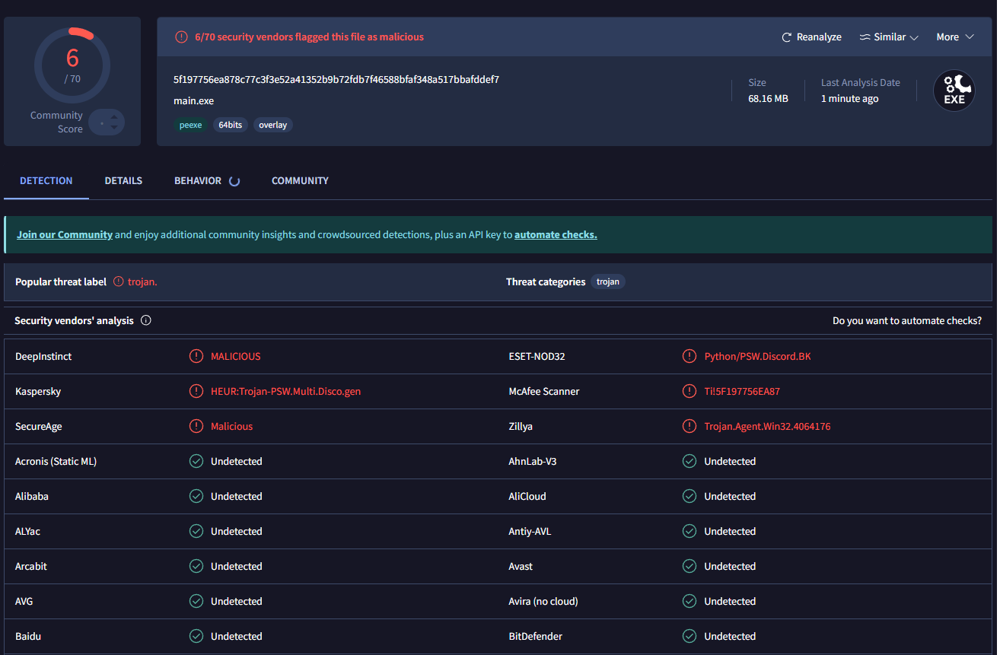

# Discord-Controlled Remote Access Tool (RAT)

## Overview
This is a small experimental project to create a **Discord-controlled Remote Access Tool (RAT)**. The bot leverages the Discord API to allow remote interaction with a target machine through various commands. The tool demonstrates an amalgamation of system management, data retrieval, and interactive functionalities.

**Note:** This project is for **educational purposes only**. Using such tools maliciously is illegal and unethical. Always ensure you have the proper authorization before running this on any system.

---



---

## Features
This tool offers a variety of commands to manage files, retrieve system information, and perform advanced system manipulations. Below is a categorized list of all available commands:

---

🟢= WORKING 🟡= WORKING PARTLY 🔴= NOT TESTED

### **File and Directory Management**
1. 🟢 **`!cd <path>`**: Changes the current working directory to the specified path.  
2. 🟢 **`!download <filepath>`**: Sends the specified file to the Discord channel if it exists.  
3. 🟢 **`!upload`**: Uploads an attached file from the Discord message to the server.  
4. 🟢 **`!delete <filepath>`**: Deletes the specified file from the host system.  
5. 🟢 **`!mkdir <directory>`**: Creates a new directory with the specified name.  
6. 🟢 **`!rm <file_or_directory>`**: Removes the specified file or directory.  
7. 🟡 **`!chmod <permissions> <file_or_directory>`**: Changes the permissions of the specified file or directory.  
8. 🟢 **`!displaydir`**: Displays the contents of the current directory.  

---

### **System Information and Controls**
9.  🟢 **`!sysinfo`**: Displays basic system information (e.g., OS, processor, machine details).  
10. 🟢 **`!admincheck`**: Checks if the bot is running with administrator privileges.  
11. 🟢 **`!idletime`**: Calculates and displays the user's idle time in seconds.  
12. 🟢 **`!taskkill <process_name>`**: Terminates a specified process.  
13. 🟢 **`!processes`**: Fetches the list of running processes.  
14. 🟢 **`!disabletaskmgr`**: Disables the Task Manager. 
15. 🟢 **`!enabletaskmgr`**: Enables the Task Manager.  

---

### **Advanced System Manipulation**
16. 🟢 **`!escalate`**: Attempts to escalate privileges to administrator. 
17. 🟢 **`!askescalate`**: Asks the user to escalate privileges to administrator.  
18. 🔴 **`!bsod`**: Attempts to trigger a Blue Screen of Death (BSOD) on the host system.  
19. 🔴 **`!masterboot`**: Attempts to overwrite the Master Boot Record (MBR).  
20. 🔴 **`!critproc`**: Makes the bot process critical.  
21. 🔴 **`!uncritproc`**: Reverts the bot process from being critical.  
22. 🔴 **`!blockinput`**: Blocks user input if the bot has admin rights.  
23. 🔴 **`!unblockinput`**: Unblocks user input if the bot has admin rights.  
24. 🔴 **`!displayoff`**: Turns off the monitor display.  
25. 🔴 **`!displayon`**: Turns on the monitor display.  

---

### **Interaction and Fun**
26. 🟢 **`!voice <message>`**: Uses text-to-speech (TTS) to speak the given message.  
27. 🟢 **`!message <text>`**: Displays a message box with the specified text on the host system.  
28. 🟢 **`!write <message>`**: Simulates typing the given message using keyboard emulation.  
29. 🟢 **`!background <image_url>`**: Changes the system background to the provided image URL.  
30. 🟢 **`!getclipboard`**: Fetches the current content of the clipboard.  
31. 🟢 **`!streamscreen <duration>`**: Starts screen streaming for the specified duration.  
32. 🔴 **`!recordcamera`**: Starts recording from the webcam until the `stop` command is received.   
33. 🔴 **`!webcampic`**: Takes a picture using the webcam and sends it in the chat.  
34. 🟢 **`!shutdown`**: Initiates a computer shutdown.  
35. 🟢 **`!restart [normal|safemode|safenetwork]`**: Restarts the computer in various modes.  

---

### **Security and Data Retrieval**
36. 🟢 **`!extracttokens`**: Finds and lists tokens from Disocrd.  
37. 🟢 **`!extractpasswords`**: Steals saved passwords from supported browsers.  
38. 🔴 **`!wifipasswords`**: Fetches and displays saved Wi-Fi passwords. 
39. 🟢 **`!doxx`**: Fetches and displays IP-related information of the user.  
40. 🟢 **`!windowsphish`**: Executes a Windows credential phishing command via PowerShell.  
41. 🟢 **`!desktopflood <name> <count>`**: Floods the desktop with files of the specified name and count.  
42. 🔴 **`!forkbomb`**: Creates and executes a fork bomb script.  

---

### **System Appearance**
43. 🟢 **`!hide_taskbar`**: Hides the Windows taskbar.  
44. 🟢 **`!show_taskbar`**: Shows the Windows taskbar.  
45. 🟡 **`!webredirect <redirection_link> <websites>`**: Redirects specified websites to a given redirection link by modifying the hosts file.  

---

### **Miscellaneous**
46. 🟢 **`!run <file>`**: Executes a file or command on the host system.  
47. 🟡 **`!regedit <key_path> <value_name> <new_value>`**: Edits a Windows registry value.  
48. 🟡 **`!startup`**: Adds the bot to launch at startup.  
49. 🟢 **`!exit`**: Closes the bot and deletes the channel where the command was invoked.  
50. 🟢 **`!instantmic`**: Streams the microphone in real-time to a selected voice channel.  
51. 🔴 **`!gdi <patinvert|patcopy|srccopy> <time>`**: Applies GDI effects on the desktop screen.  

---

## Installation and Setup
1. Clone the repository:
    ```bash
    git clone <https://github.com/Kraz74pq1/Data-Leaker>
    cd <repository-directory>
    ```

2. Install the required dependencies.

3. Configure your Discord bot token in the source code.

4. Compile the RAT using pyinstaller.

5. Deploy the compiled executable to your intended system.

6. Control the RAT via your Discord server.
---

## Disclaimer
This project is strictly for **educational purposes**. Unauthorized use or deployment of this tool is illegal and unethical. Always ensure that you have explicit permission before using this tool on any system.
